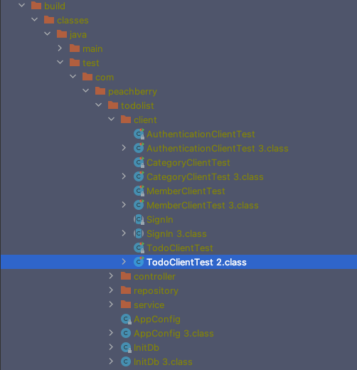
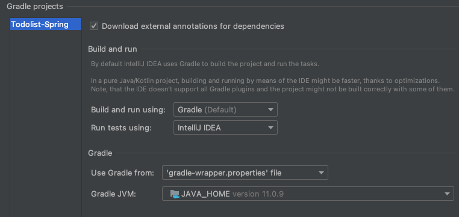

# Todolist-Spring 

## 💡 주제
### Todolist
유저가 인증을 통해 로그인을 하고 자신의 하루의 할일 목록을 등록할 수 있는 서비스를 제공
### 지켜야할 규약
1. `Unit Test`를 작성하기
2. `OOP`의 개념을 지키면서 만들기
3. 작성시 `indent 2`를 넘기지 않기
4. 메서드에 `10줄 이상` 작성하지 않기

위의 4가지 것들을 지키며 프로젝트를 진행할려고 한다

## 🔍 요구사항
### 회원
- 회원가입
- 로그인
- 회원정보 조회
### 권한
- 회원가입시 권한 부여(일반은 USER)
### Todo 기능
- 카테고리 지정(1개만 가능)
- 날짜 지정 (년 월 일)
- Todo 작성
- Todo 수정
- Todo 삭제
- Todo 완료
### 카테고리 기능
- Todo에 카테고리 적용
- 카테고리 생성
- 카테고리 수정
- 카테고리 삭제

## 🔨 기술 스택
- Spring Framework
- Spring Web
- Spring Security
- H2 (Test)
- Mysql
- JPA(Hibernate)
- jjwt
- Rest api


## 🛠 설계
### DB설계
<details>
<summary>
펼쳐보기
</summary>


</details>

### 백엔드 설계
<details>
<summary>
펼쳐보기
</summary>

**아키텍처**


**다이어그램**

</details>

## 📡 API

### Todo API

|HttpMethod|URL|Parameters|
|---|---|---|
|POST|/todo/{member-id}|title : String, status : Enum, category-id : Long|
|GET|/todo/{member-id}/all||
|GET|/todo/{member-id}/{todo-id}||
|GET|/todo/{member-id}|datetime : String|
|GET|/todo/{member-id}|status : boolean|
|PUT|/todo/{member-id}|title : String|
|PUT|/todo/{member-id}|datetime : String|
|PUT|/todo/{member-id}|status : boolean|
|DELETE|/todo/|todoId : Long|

### Category API
|HttpMethod|URL|Parameters|
|---|---|---|
|POST|category/{member-id}|title : String|
|GET|category/{member-id}/all||
|GET|category/{member-id}|title : String|
|PUT|category/{member-id}|title : String|
|DELETE|category/{member-id}/{category-id}||

### Authentication API
|HttpMethod|URL|Parameters|Return|
|---|---|---|---|
|POST|/auth/signup|name : String</br> email : String</br> password : String|id : Long|
|POST|/auth/signin|email : String</br> password : String|login : true|
|GET|/auth/signout| |login : false|
|GET|/auth/issue-access||

### Member API
|HttpMethod|URL|Parameters|
|---|---|---|
|GET|/member/{member-id}||


## 오류 해결 & 개선사항
- PathVariable 사용할때에 name 명시해주기
<details>
<summary>
테스트는 성공했지만 기본 gradle 패키지 테스트가 실패했을 경우
</summary>


위와 같은 에러를 마주칠 경우가 생긴다 물론 각자의 상황마다 다른 에러일 수 있지만 내가 마주친 에러에 대해서 풀어보고자 한다  


test 상황을 보여주는 index.html에 들어가보면 어디서 에러가 났는지 상세하게 볼 수 있는데  
자세히 살펴보면 잘못된 이름에 클래스 파일이 존재한다는 이야기다  
그래서 gradle의 build 디렉토리에 들어가본다  



그러면 위의 상황과 같이 2나 3이 붙은 클래스 파일들이 존재하는 것이 보이는데  
위와 같은 문제가 발생하는 이유가 다양할 수 있겠지만  
내가 겪은 바로는 인텔리제이 gradle 설정에서 test할때 gradle을 기본적으로 사용하게 되는데  
테스트 코드 같은 경우는 gradle로 할 경우 항상 새롭게 build 파일에 중복해서 쌓이는 경우가 발생하게 되는데  
그래서 위와 같은 오류가 발생하게 된다  



위의 사진과 같이 Run tests using 부분을 Gradle -> IntelliJ 로 변경해주면 문제없이 작동되는 것을 볼 수 있다  

</details>

- [controller layer 커스텀 필터 끼고 테스트](https://peachberry0318.tistory.com/32)

<details>
<summary>
동적 쿼리를 위해 querydsl 도입하기
</summary>

### 기존 코드

- **기존 컨트롤러 코드**
```java
@RestController
@RequestMapping("/todo")
public class TodoController {
        
    @GetMapping("/{member-id}")
    public ResponseEntity<TodoResponse.TodoInfoList> getTodoByParam(
            @RequestParam Map<String, String> param,
            @PathVariable(name = "member-id") Long memberId) {
        List<TodoResponse.TodoInfo> result = new ArrayList<>();

        if (param.get("status") != null) {
            List<Todo> todoList = todoService.findTodoByStatus(
                    TodoStatus.valueOf(param.get("status")),
                    memberId);
            result = toTodoInfoList(todoList);
        }
        if (param.get("datetime") != null) {
            List<Todo> todoList = todoService.findTodoByCalendar(
                    LocalDate.parse(
                            param.get("datetime"),
                            DateTimeFormatter.ISO_LOCAL_DATE
                    ),
                    memberId);
            result = toTodoInfoList(todoList);
        }

        return ResponseEntity.ok(new TodoResponse.TodoInfoList(result));
    }
}
```
- **기존 service 코드**
```java
@Service
public class TodoService {

    @Transactional
    public List<Todo> findTodoByStatus(TodoStatus status, Long member_id) {
        return todoRepository.findByStatus(status, member_id);
    }

    @Transactional
    public List<Todo> findTodoByCalendar(LocalDate date, Long member_id) {
        return todoRepository.findByDateTime(date, member_id);
    }
}
```
- **기존 repository 코드**
```java
@Repository
public class TodoRepository {
    /**
     * 완료상태를 가지고 값을 찾는다
     * @param status 찾고 싶은 상태
     * @param member_id 현재 로그인된 member
     * @return 해당하는 todo를 list로 반환한다
     */
    public List<Todo> findByStatus(TodoStatus status, Long member_id) {
        return em.createQuery("select td from Todo td where td.status = :status and td.member.id = :id", Todo.class)
                .setParameter("status", status)
                .setParameter("id", member_id)
                .getResultList();
    }

    /**
     * 날짜 정보를 가지고 todo를 찾는다
     * @param date 찾고 싶은 날짜
     * @param member_id 현재 로그인된 member
     * @return 해당하는 todo를 list로 반환한다
     */
    public List<Todo> findByDateTime(LocalDate date, Long member_id) {
        return em.createQuery("select td from Todo td where td.date =:date and td.member.id = :id", Todo.class)
                .setParameter("date", date)
                .setParameter("id", member_id)
                .getResultList();
    }
}
```
위에 코드를 보시면 아시겠지만 controller 계층에서 null체크를 하고 조건에 따라서 service 계층의 메서드를 부르는 것을 볼 수 있다
조건 별로 service 계층에서 따로 메서드를 분리해서 사용하는 모습도 보인다
이 코드를 한번 querydsl로 동적쿼리를 만들어보고자 한다

### build.gradle 의존성 설치 (gradle 5.0 이상)
```groovy
dependencies {
	compile 'com.querydsl:querydsl-core'
	compile 'com.querydsl:querydsl-jpa'
	annotationProcessor "com.querydsl:querydsl-apt:${dependencyManagement.importedProperties['querydsl.version']}:jpa"
	annotationProcessor 'jakarta.persistence:jakarta.persistence-api'
	annotationProcessor 'jakarta.annotation:jakarta.annotation-api'
}

// 아래로는 QClass들을 담을 패키지 생성을 해주는 코드 
def generated='src/main/generated'
sourceSets {
	main.java.srcDirs += [ generated ]
}

tasks.withType(JavaCompile) {
	options.annotationProcessorGeneratedSourcesDirectory = file(generated)
}

clean.doLast {
	file(generated).deleteDir()
}
```

### 변경 후 코드
- **변경 후 controller 코드**
```java
@RestController
@RequestMapping("/todo")
public class TodoController {

    private final TodoService todoService;

    public TodoController(TodoService todoService) {
        this.todoService = todoService;
    }

    @GetMapping("/{member-id}")
    public ResponseEntity<TodoResponse.TodoInfoList> getTodoByParam(
            @RequestParam Map<String, String> param,
            @PathVariable(name = "member-id") Long memberId) {

        List<Todo> result = todoService.findByDynamicParam(param.get("status"), param.get("datetime"), memberId);

        return ResponseEntity.ok(new TodoResponse.TodoInfoList(toTodoInfoList(result)));
    }
}
```
- **변경 후 service 코드**
```java
@Service
public class TodoService {
    @Transactional
    public List<Todo> findByDynamicParam(String status, String datetime, Long memberId) {

        return todoRepositorySupport.findDynamicQuery(datetime, status, memberId);
    }
}
```
- **변경 후 repository 코드**
```java
@Repository
public class TodoRepositorySupport extends QuerydslRepositorySupport {

    private final JPAQueryFactory queryFactory;

    public TodoRepositorySupport(JPAQueryFactory queryFactory) {
        super(Todo.class);
        this.queryFactory = queryFactory;
    }

    public List<Todo> findDynamicQuery(String date, String status, Long memberId) {
        return queryFactory
                .selectFrom(todo)
                .where(
                        getStatus(status),
                        getDate(date),
                        todo.member.id.eq(memberId)
                )
                .fetch();
    }

    private BooleanExpression getDate(String date) {
        if(date == null) {
            return null;
        }
        return todo.date.eq(LocalDate.parse(date));
    }

    private BooleanExpression getStatus(String status) {
        if(status == null) {
            return null;
        }
        return todo.status.eq(TodoStatus.valueOf(status));
    }
}
```
기존에는 controller에서 null체크를 해주었고 조건에 따라 분리된 service 계층 메서드가 존재했다  
querydsl을 적용한 다음에는 별도의 로직을 controller와 serive에서 해줄 필요없이 마지막 repository에서 처리가 가능하다  


</details>