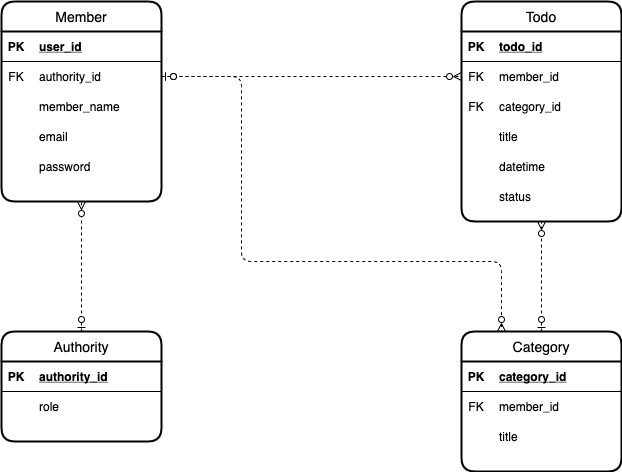
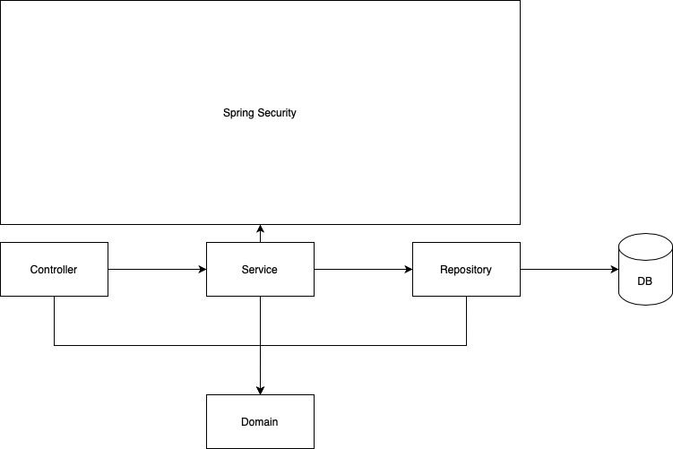
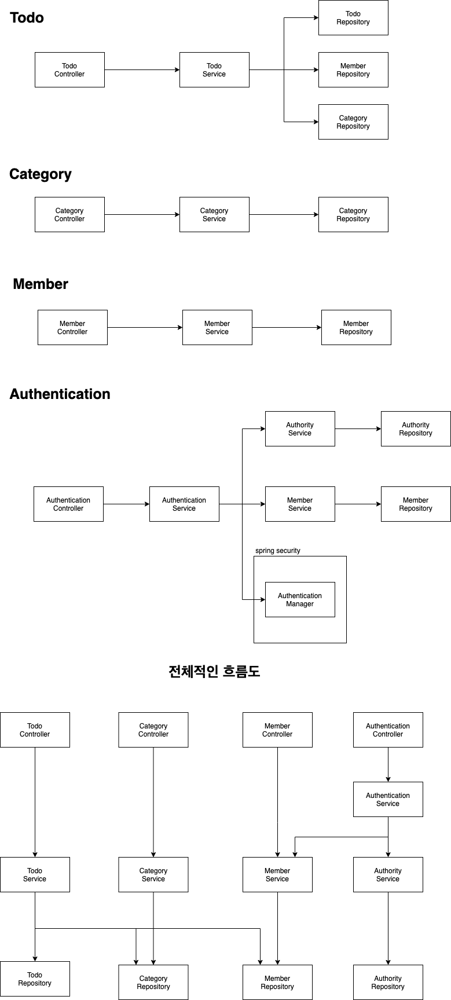

# Todolist-Spring

## 💡 주제
### Todolist
유저가 인증을 통해 로그인을 하고 자신의 하루의 할일 목록을 등록할 수 있는 서비스를 제공
### 지켜야할 규약
1. `Unit Test`를 작성하기
2. `OOP`의 개념을 지키면서 만들기
3. 작성시 `indent 2`를 넘기지 않기
4. 메서드에 `10줄 이상` 작성하지 않기

위의 4가지 것들을 지키며 프로젝트를 진행할려고 한다

## 🔍 요구사항
### 회원
- 회원가입
- 로그인
- 회원정보 조회
### 권한
- 회원가입시 권한 부여(일반은 USER)
### Todo 기능
- 카테고리 지정(1개만 가능)
- 날짜 지정 (년 월 일)
- Todo 작성
- Todo 수정
- Todo 삭제
- Todo 완료
### 카테고리 기능
- Todo에 카테고리 적용
- 카테고리 생성
- 카테고리 수정
- 카테고리 삭제

## 🔨 기술 스택
- Spring Framework
- Spring Web
- Spring Security
- H2 (Test)
- Mysql
- JPA(Hibernate)
- jjwt
- Rest api

## 🛠 설계
### DB설계

펼쳐보기

### 백엔드 설계

펼쳐보기

**아키텍처**

**다이어그램**

## 📡 API

### Todo API

|HttpMethod|URL|Parameters|
|---|---|---|
|POST|/todo/{member-id}/{category-id}|title : String|
|GET|/todo/{member-id}/all||
|GET|/todo/{member-id}|datetime : String|
|GET|/todo/{member-id}|status : boolean|
|PUT|/todo/{member-id}|title : String|
|PUT|/todo/{member-id}|datetime : String|
|PUT|/todo/{member-id}|status : boolean|
|DELETE|/todo/{member-id}/{todo-id}||

### Category API
|HttpMethod|URL|Parameters|
|---|---|---|
|POST|category/{member-id}|title : String|
|GET|category/{member-id}/all||
|GET|category/{member-id}|title : String|
|PUT|category/{member-id}|title : String|
|DELETE|category/{member-id}/{category-id}||

### Authentication API
|HttpMethod|URL|Parameters|
|---|---|---|
|POST|/auth/signup|member-name : String, email : String, password : String|
|POST|/auth/signin|email : String, password : String|
|GET|/auth/signout||
|GET|/auth/issue-access||

## ❌ 오류 해결
