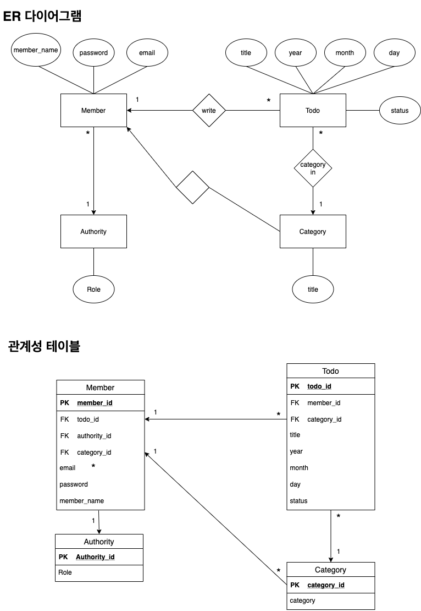

# Todolist-Spring

## :bulb: 주제
### Todolist
여러 사람들이 프론트엔드 입문이라고 부르는 Todo앱을 Spring backend를 이용해서 구현할 것이다 
이것을 선택한 이유는 간단한 것 부터 구현함으로써 자신감을 얻기 위해서이다 
 **지켜야할 규약**
1. `Unit Test`를 작성하기
2. `OOP`의 개념을 지키면서 만들기
3. 작성시 `indent 2`를 넘기지 않기
4. 메서드에 `10줄 이상` 작성하지 않기

위의 4가지 것들을 지키며 프로젝트를 진행할려고 한다

## :mag_right: 요구사항
### 회원
- 회원가입
- 로그인
- 회원정보 조회
### 권한
- 회원가입시 권한 부여(일반은 USER)
### Todo 기능
- 카테고리 지정(1개만 가능)
- 날짜 지정 (년 월 일)
- Todo 작성
- Todo 수정
- Todo 삭제
- Todo 완료
### 카테고리 기능
- Todo에 카테고리 적용
- 카테고리 생성
- 카테고리 수정
- 카테고리 삭제

## :hammer_and_wrench: 설계
### DB설계

### 백엔드 설계
**아키텍처**

**다이어그램**

